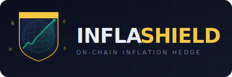
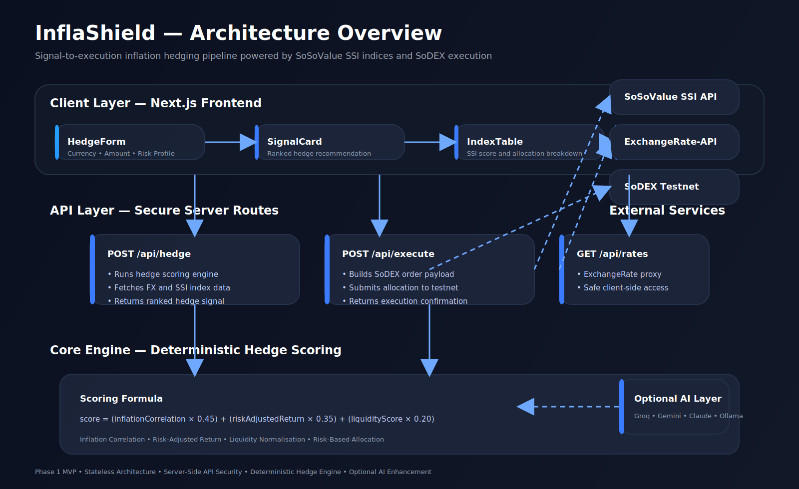

<p align="center">
  
</p>

<h1 align="center">InflaShield</h1>

<p align="center">
  <strong>On-chain inflation hedge agent — protect your purchasing power, anywhere in the world.</strong>
  <br/><br/>
  <a href="LICENSE"></a>
  <a href="https://sosovalue.com"></a>
  <a href="https://sodex.com"></a>
</p>

---

## The Problem

Inflation erodes purchasing power. It is not a Nigerian problem, or a Turkish problem, or an Argentine problem — it is a **global, persistent, and accelerating crisis** that hits hardest in economies where traditional financial hedges are out of reach.

| Country | Inflation Rate (2024) | Traditional Hedge Access |
|---|---|---|
| Argentina | ~140% | Restricted — capital controls |
| Turkey | ~65% | Limited — lira instability |
| Nigeria | ~33% | Blocked — FX restrictions |
| Egypt | ~30% | Minimal — dollarization pressure |
| Pakistan | ~23% | Scarce — banking exclusion |
| United Kingdom | ~3–5% | Partial — index funds available |
| United States | ~3% | Full — but crypto-native users under-served |

The pattern is universal: **people who most need inflation protection have the least access to it.**

Traditional hedges — gold ETFs, index funds, USD accounts, treasury bonds — require a broker, a bank, citizenship paperwork, or a minimum balance most people cannot meet. On-chain finance changes that equation entirely, but the discovery and execution layer has not caught up.

---

## The Solution

**InflaShield** is a signal-to-execution agent built on SoSoValue's infrastructure that:

1. Takes a user's local currency savings amount and risk tolerance
2. Fetches live exchange rate data and SoSoValue SSI index performance
3. Scores each on-chain index as an inflation hedge against the user's currency
4. Generates a clear, plain-language rebalance recommendation
5. Executes the allocation directly on SoDEX — no broker, no bank, no paperwork

The entire flow — from problem to protection — in under 60 seconds.

---

## Key Features

- **Multi-currency support** — works with any fiat currency (USD, EUR, GBP, NGN, TRY, ARS, BRL, EGP, PKR, and more)
- **SSI index scoring** — ranks SoSoValue indices by inflation-hedge correlation for your specific currency pair
- **Plain-English signals** — no financial jargon; users understand exactly what they are doing and why
- **One-click SoDEX execution** — the signal connects directly to SoDEX testnet (mainnet-ready in Phase 2)
- **Risk tiers** — conservative, balanced, and aggressive allocation profiles
- **AI-enhanced reasoning** *(optional)* — if an AI API key is configured, adds natural-language justification; the core engine runs fully without it
- **No wallet lock-in** — outputs are standard SoDEX order payloads; any compatible wallet can execute

---

## How It Works

### System Architecture



### Flow Breakdown

```
User Input
  └── Local currency + savings amount + risk level
        │
        ▼
Data Fetch Layer
  ├── Live FX rate  (ExchangeRate-API — free, no key required)
  └── SSI index data (SoSoValue API — top indices, 30-day performance, composition)
        │
        ▼
Hedge Engine  (rule-based scoring; AI layer is optional enhancement)
  ├── Compute USD-equivalent exposure
  ├── Score each index: inflation correlation × risk-adjusted return × liquidity
  └── Rank and select top allocation
        │
        ▼
Signal Card
  ├── Recommended allocation (% per index)
  ├── Plain-English rationale
  └── Risk summary
        │
        ▼
SoDEX Execution
  └── Order submitted to SoDEX testnet → confirmation receipt
```

See [ARCHITECTURE.md](ARCHITECTURE.md) for the full technical breakdown.

---

## Tech Stack

| Layer | Technology | Notes |
|---|---|---|
| Frontend | Next.js 14 (App Router) + TypeScript | SSR for performance |
| Styling | Tailwind CSS | Utility-first, no design system dependency |
| Index data | SoSoValue SSI API | Core required integration |
| Exchange rates | ExchangeRate-API | Free tier, no key needed |
| Execution | SoDEX Testnet API | Buildathon access |
| AI reasoning | Claude / Groq / Gemini | **Optional** — see [docs/AI.md](docs/AI.md) |
| Deployment | Vercel | Free tier sufficient for demo |

---

## Quick Start

### Prerequisites

- Node.js 18+
- npm or yarn
- A SoSoValue API key ([register here](https://sosovalue.com) → API Documentation)
- SoDEX Testnet access ([register here](https://sodex.com))

### 1. Clone and install

```bash
git clone https://github.com/YOUR_USERNAME/inflashield.git
cd inflashield
npm install
```

### 2. Configure environment

```bash
cp .env.example .env.local
```

Fill in your keys (see [docs/SETUP.md](docs/SETUP.md) for a step-by-step guide to getting each one):

```env
SOSOVALUE_API_KEY=your_key_here
SODEX_API_KEY=your_key_here
# Optional — enables AI-enhanced reasoning
AI_API_KEY=your_key_here
AI_PROVIDER=groq   # groq | anthropic | gemini
```

### 3. Run locally

```bash
npm run dev
```

Open [http://localhost:3000](http://localhost:3000).

### 4. Run on testnet

No extra configuration needed — testnet is the default. Set `SODEX_ENV=mainnet` only when you have mainnet access.

---

## API Integrations

| API | Purpose | Docs | Free Tier |
|---|---|---|---|
| SoSoValue SSI | Index data, composition, performance | [Link](https://sosovalue-1.gitbook.io/sosovalue-api-doc) | Registration required |
| SoDEX Testnet | Order submission, portfolio read | [Link](https://sodex.com/documentation/api/api) | Open access |
| ExchangeRate-API | Live FX rates (170+ currencies) | [Link](https://www.exchangerate-api.com/docs/overview) | 1,500 req/month free |

See [docs/API.md](docs/API.md) for endpoint reference, request/response shapes, and code examples.

---

## Project Structure

```
inflashield/
├── README.md               ← You are here
├── ARCHITECTURE.md         ← Technical design decisions
├── ROADMAP.md              ← Phase 1, 2, 3 plan
├── CONTRIBUTING.md         ← How to contribute
├── .env.example            ← Environment variable template
├── docs/
│   ├── API.md              ← Full API reference + examples
│   ├── SETUP.md            ← Step-by-step setup guide
│   └── AI.md               ← AI integration options (optional)
├── src/
│   ├── app/                ← Next.js App Router pages
│   ├── components/         ← React UI components
│   ├── lib/
│   │   ├── api/            ← API client wrappers
│   │   ├── engine/         ← Core hedge scoring logic
│   │   └── types/          ← Shared TypeScript types
│   └── config/             ← App-wide constants
└── public/                 ← Static assets
```

---

## Roadmap

| Phase | Status | Scope |
|---|---|---|
| Phase 1 | **In progress** | Core agent, signal card, SoDEX testnet execution |
| Phase 2 | Planned | Wallet connect, alert notifications, backtesting |
| Phase 3 | Planned | Mainnet execution, mobile UI, strategy marketplace |

See [ROADMAP.md](ROADMAP.md) for full breakdown.

---

## Supported Currencies (Phase 1)

InflaShield ships with exchange rate support for all currencies available via ExchangeRate-API, including:

`USD` `EUR` `GBP` `NGN` `TRY` `ARS` `BRL` `EGP` `PKR` `INR` `GHS` `KES` `ZAR` `VES` `IRR` `JPY` `CNY` and 150+ more.

Currency support is data-driven — adding a new currency requires no code change.

---

## Live Demo

> Demo link: **[https://inflashield.vercel.app](https://inflashield.vercel.app)** *(update before submission)*

---

## Team

| Name | Role | Contact |
|---|---|---|
| Amas-01 | Lead developer | Stealthdev301@email.com |

---

## License

MIT — see [LICENSE](LICENSE).

---

## Acknowledgements

Built during the **SoSoValue Buildathon** using:
- [SoSoValue](https://sosovalue.com) — SSI Protocol and Terminal data
- [SoDEX](https://sodex.com) — on-chain orderbook execution
- [ExchangeRate-API](https://www.exchangerate-api.com) — live FX data
